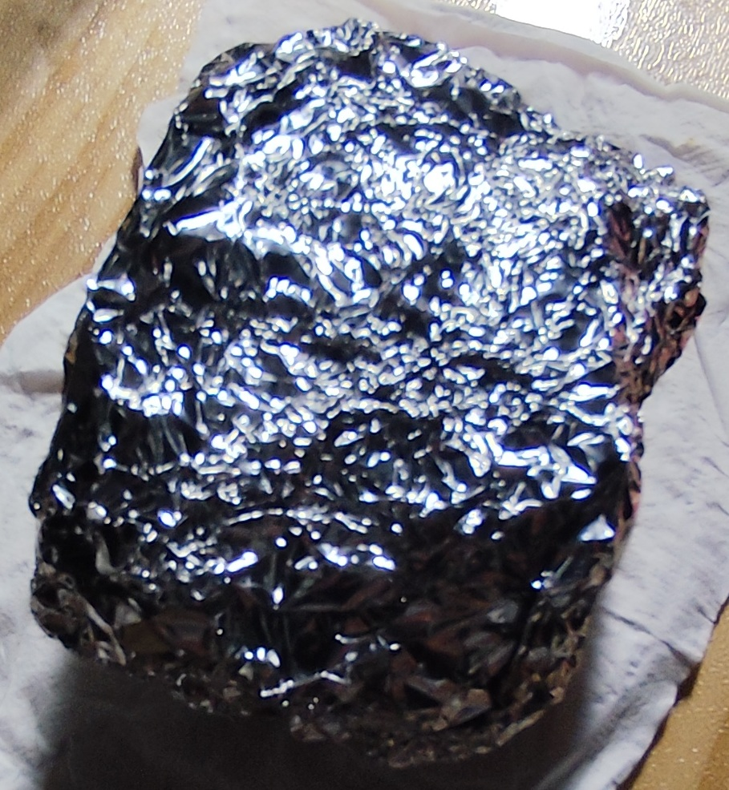

[TOC]  

# 2025.03.22 小记 —— 特殊电磁场的“开盒”
  
  

**//- 补： 特殊电磁场的“开盒”     2025.08.13 02:07**    
  
睡觉用耳机播放器被“操控”经常插入大提示音， 不能再用。    
后来4月份买个hp蓝牙可插卡小音箱和便宜插卡无蓝牙MP3， 一直使用着自个都没修动过。    
hp蓝牙小音箱， 夜间睡觉时用最小音量播放TF卡中“骂人”的。 没动蓝牙。    
近一周多， 蓝牙小音箱又被“开盒”： 夜间睡觉时， 时不时突然巨响、 似最大音量自个播“提示音”。    
经过观察， 这提示音可确认是被操控的， 而不是自个故障。(记录此， 立即挑衅显摆播大音量提示音)。 要么炫耀显摆连着>3次播提示音、 要么作为入睡点准确攻击、 要么半夜莫名突然“轰”醒。    
..   
2025.08.13 02:00-+   
用铝箔将小音箱全包了几层， 再压结实了，   
居然还能“被控”蹦出提示音..   
这下搞不明白用的啥技术了.. 已知道的地球现代科技水平的电磁波能穿透这近似密闭的多层金属铝箔？   
(按现有已有技术， 难道是声场技术？)    
  

   
   
  
  
  
  
  

**//- 2025.03.22**    
狗日的欠操的阴渠垃圾畜牲杂种总发骚欲求不满！    
  

## 一、 后门 
一群阴渠垃圾， 狗屁不懂的粪坑臭虫蛆虫， 有邪教的纵容， 各种肆无忌惮大张旗鼓炫耀其垃圾sb白痴！    
电脑、 手机、 APP、 网络设备、 平台等， 各种乱七八糟后门。 然后电脑和手机等被搞得乱七八糟， 用得恼求火。    
iPad 上的验证码也能被操控， 即使 iCloud 验证码。 iPad 飞行模式下， 曾发现一次明显异常。    
  
  

以前常用的 Dell_G7 笔记本电脑， 想做点事， 结果一群狗屁不懂的垃圾， 被搞得乱七八糟乌烟瘴气， 弄得暴跳如雷， 只好拆了网卡， 换用有线鼠标。 需要时再用 USB 网卡。    
结果， 趁 USB网卡联网时， 各种破坏。    
稀奇的是， 没有网卡了， 这些垃圾似乎还能进行一些操控， 猜不出咋回事了。    
...    
拖了好久， 还是买个 铁威马 D2 硬盘盒， USB-C 接口。 买块希捷8T企业盘。    
备份 Dell_G7 各分区2次， 备份拷贝到移动硬盘盒时 没发现大的异常。    
  
  

**异常现象（不联网情况下）：**    
Dell_G7 上5400转机械硬盘某工作分区 数据 400G 左右， 小文件不少， 2次备份拷贝都差不多 3小时。    
凌晨新建一个管理员账户， 比较该分区与硬盘盒备份1， 结果从凌晨开始一直比较了_**15个小时**_。    
期间， CPU 利用率不到 10%， 内存利用不到 50%， 而该机械硬盘活动时间 100%， 读取速度 ~10MB/秒。 移动硬盘的活动时间则 10% 左右， 读取速度也仅 ~10MB/秒。    
...    
恼求火。    
  

晚上了， 再比较该分区与硬盘盒备份2。 _**速度上来了， 仅用2个半小时**_， 多数时候 Dell_G7 本机机械硬盘活动时间 >90%， 读取速度 ~90MB/秒。    
  

再比较硬盘里的两个备份， 用时接近但不到2小时。    
  
  
  
  
  

## 二、 特殊电磁场的“开盒” 
芯片开盒、 大脑开盒！    
  

**2.1**    
被这些垃圾骚扰得不胜其烦！    
曾买了2个手机信号屏蔽袋、防电磁辐射袋， 布袋里有层防电磁辐射布料，    
手机放里面封严， 倒是能断网、 蓝牙耳机断链之类。    
  

不过， 怀疑其效果。    
后来单独买些 防电磁辐射挡布料， 效果其实一般，    
所以有需要时， 多还是用几层烧烤铝箔裹压严实。    
  

**2.2**    
以前被针对性声音折磨得够呛， 所以买了不少便宜的50元左右的蓝牙大耳机、 蓝牙小音箱。    
便宜的耳机， 当然容易坏， 不过有的只是头挂架断了， 不想扔， 还有一小点渣渣动手力， 就拆装几下。    
  

_**留1边耳机壳， 割断PCB板上蓝牙印刷天线的根部（似乎或许应该割芯片引出时）， 2个喇叭线换接出个有线耳机插座， 使用有线耳塞， 再插1个TF卡， 当播放器用。**_    
_**晚上睡觉时， 打开这个一直插着TF卡的耳机播放器， 自动播放轻音乐后， 放入 手机信号屏蔽袋， 不过引出了有线耳麦， 再放到枕头边， 睡觉时戴上听听低音量轻音乐。**_    
  
  

**异常现象：**    
这些垃圾， 咋发现我晚上睡觉时戴着耳麦的？ 又咋知道我改造的这个“播放器”?  虽然耳麦和手机信号屏蔽袋扔在枕头边， 但每次出门都将 “播放器” 带走的。    
  

这个播放器， 原本的蓝牙大耳机， 固化有些“提示语”。    
一个月前， 晚上睡觉时， 偶然醒， 发现咋**在听音乐过程中突然冒出“提示语”**？ 提示语是全音量的， 我睡觉听轻音乐的音量不到10， 提示语的全音量则>20， 当然经常性吵醒。    
  

初一段时间， 一天就一两次。    
近期， 这欠操的欲求不满的垃圾， 越来越燥性， 一打开播放器就频繁弄出提示语， 一个劲的炫耀它们的SB！    
**而且垃圾们闲玩得不过瘾， 就开始耍花样， 一会多个提示语各种混杂、 一会连续十多分钟都只播放各种提示语将正常的音乐播放给挤走了掩盖了...**    
  
  

**猜测1：**    
虽然平常用蓝牙耳机听手机声音， 早就被这些畜牲“插入了中继设备”， 蓝牙耳机是先连上这“伪设备”， 再连上的手机。 这样就让这些阴渠垃圾随时偷窥和操控了。 细节见以前的。    
  

但现在这乱播提示语， 不像全部是蓝牙链路的操控。    
首先， 我这播放器直接进入的TF卡播放。    
其次， 蓝牙印刷天线也割了， 手机信号屏蔽袋仅耳塞线牵出来， 应该不会馈入蓝牙信号吧？    
接着， 这些提示语， 不仅仅有手动操作时 连贯的正常的提示语， 还有混杂的    
  

怀疑1， 是某种特殊的电磁场能穿过手机信号屏蔽袋， 或者特殊电磁波沿着耳塞线窜入到电路里。 而_**不是使用蓝牙链路**_， 没有按照蓝牙协议和蓝牙接口调用芯片提供的功能。    
  
  

**猜测2：**    
假设某块电路有2个指令， 其正常逻辑的提示语是 _**“脑控畜牲”、 “畜牲全家必须死”**_， 但存储时、 或物理邻接的或许不是按顺序的， 或许物理临近的存储体是 _**“脑控畜牲全家畜牲必须死”**_   
  

而咱的烂渣渣便宜蓝牙耳机， 芯片也不会太贵， 应该是_**没做到多声源混音**_， 所以播放提示语时就不能播放音乐。    
  

怀疑2， 这些畜牲使用特殊电磁场电磁波， 能够“开盒”式侵入芯片， 但是并没找全找对使用蓝牙功能， 却是直接遍历芯片物理区域找到了能发声的“提示语”存储区， 然后按芯片里的物理临近区找到提示语然后再抢占播放， 所以才造成了各种乱窜的、 混杂的“提示语”...    
  
  

**猜测3：**    
摸到芯片音源编码区， 然后就敢瞎猜播放..    
这些垃圾操作， 就跟当前“脑控”瞎操作一般，    
  

先乱抓无辜民众做试验小白鼠， 通过头部一些外科手术比如牙科拔牙、 假牙等偷偷植入能与神经接触的介质   
安排各种狗日的畜牲杂种在周边用声音刺激折磨小白鼠， 发现最初对应脑神经信号，    
周边环境操控制作特殊场景， 强迫小白鼠接触产生反映， 然后瞎猜一些特殊名词发音对应的脑神经信号，    
通过夜间睡觉时枕头边特殊电磁场（微波CT？）， 再找到对应脑区域，    
  

再接着就制造刺激脑区域， 让混乱输出某个脑区域的“记忆存储”！ 但是输出又不都是“有逻辑正常的”！ 于是小白鼠就多被折磨成精神病之类！    
  
  
