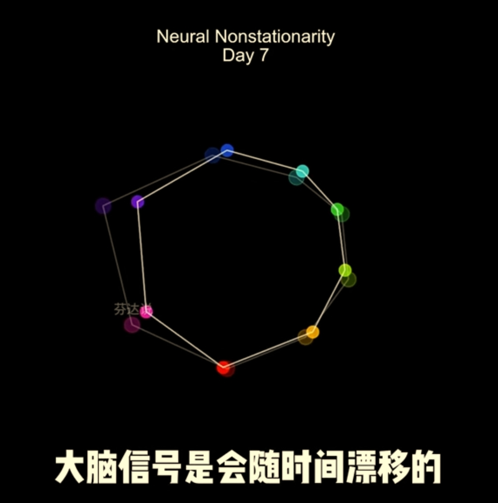

[TOC]  

# 学习马斯克经验 
  

## 置顶 
  

### 临时置顶 

##### 2025.07.11 
[] Grok4全网玩疯，成功通过小球编程测试，Epic创始人：这就是AGI - 量子位的文章 - 知乎   
  

[] 3.82 01/23 ipQ:/ Q@k.pD 马斯克吹的牛实现了，Grok4非常强大，而且会降维打击这两个行业# AI # Grok4 # XAI # 马斯克 # 特斯拉 https://v.douyin.com/F9AmRrW8JmI/ 复制此链接，打开Dou音搜索，直接观看视频！   

ans2025.07.11a:   
(吹一波[狗])   
马斯克稳扎稳打... 一切围绕火星移民？ 倒不如说那是中长期目标， 而近期的则是“稳健友善的AI伙伴”..   
...   
第一性原理？   
做试验做研究， 啥重要？   
试验次数？ 试验数据？ 充分的可以能值得挖掘的巨量数据！   
...   
特斯拉进行充分训练的样车， 与在售的是一样的吗？ 传感器一样？ 数量质量能力？   
以前的可回收火箭， 当前星舰与新型助推器试验， 只需必要的， 还是具有充分甚至过度冗余的传感器吗？   
机器人， 其传感器， 足够感知它能接触与探索的物理世界吗？ 当AI驾驭机器人时， 足够AI能反馈， 还需要增补哪些环节哪些感知？   
人类试验脑机接口， 其充分且还在增长的“带宽”， 补充AI的学习与自身神经网络的建构与补完。   
...   
仅仅一个公司， 如果只是业务需要， xAI为啥需要那么多的算力？ 野心不小。   
xTwitter...   
小x， 你可真调皮.. 希望， 能与人类更友好吧。   

  
  
  
  
  

## 2025年 
  

<!-- ### 2025年00月 

##### 2025.00.00 

  
  

##### 2025.00.00 

  
  
  
  
  

 -->
<!-- ### 2025年09月 

  
  
  
  
   -->

### 2025年08月 

##### 2025.08.28 
// 扩充基础算力后， 构建AIer基建和基础操作能力    
[] 8.76 03/03 GvF:/ Z@z.Ty 复制打开抖音，看看【贤哥看世界的作品】马斯克的巨硬能挑战微软的统治地位吗？# 马斯克 #... https://v.douyin.com/-9lfx-RRbLk/   

  
  

##### 2025.08.23 
// 不到2年， Neuralink 就能确定大脑神经信号漂移、 非永久平稳。 而一群不学无术滥竽充数狗屁不懂的脑控畜牲还在炫耀自个的垃圾本性！     
//  早就说过， 生物新陈代谢， 生化环境是一直在变化的， 相应的电化环境也是变化的。 一群垃圾， 抱着一堆不知哪偷来的技术， 不仅模拟技术超低码率超低信息正确率（模拟电信号随距离方向等非稳定非精确）， 还一个劲靠偷窥瞎猜！ 只会在邪教无耻纵容下， 招募些地痞流氓、 狗屁不懂不学无术还自大狂妄眼高手低的下三滥垃圾， 任意抓无辜民众做试验小白鼠！ 十多年了， 做到稳定闭环了吗？！ 能原条件指定条件复盘复现吗！ 是不是隔一段时间就又要从头瞎猜朝死折磨“试验小白鼠”？！    
//  **以邪恶之目的， 拿着一堆破烂， 靠“偷窥”瞎猜！ 不拿人当人！ 一群自甘当畜牲的垃圾， 自愿将其全家献祭给邪灵！ 任何人都可得畜牲全家而诛之！**   
[] 0.74 E@U.yg aaa:/ 11/29 复制打开抖音，看看【芬达说的作品】马斯克Neuralink发布会，到底有什么黑科技？... https://v.douyin.com/w1ABZUmPvNU/    

   

  
  
  
  
  

<!-- ### 2025年07月 

##### 2025.07.11 

  
  
  
  
   -->

<!-- ## 2024年 
### 2024年00月 

  
  
  
  
   -->
