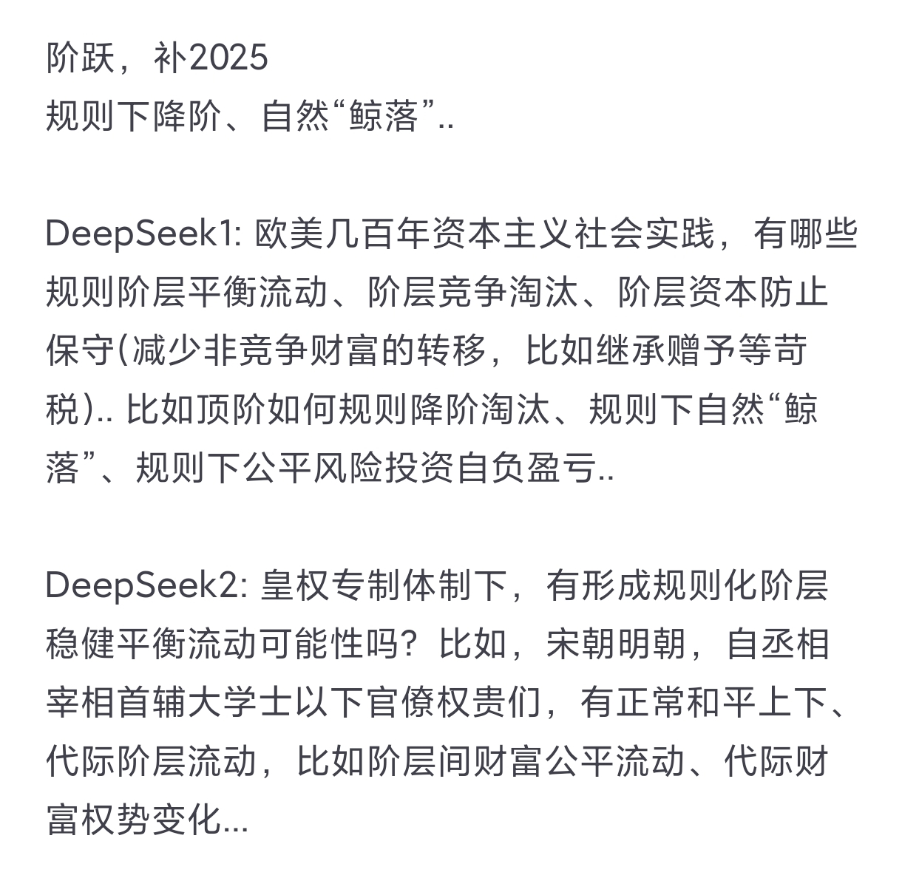
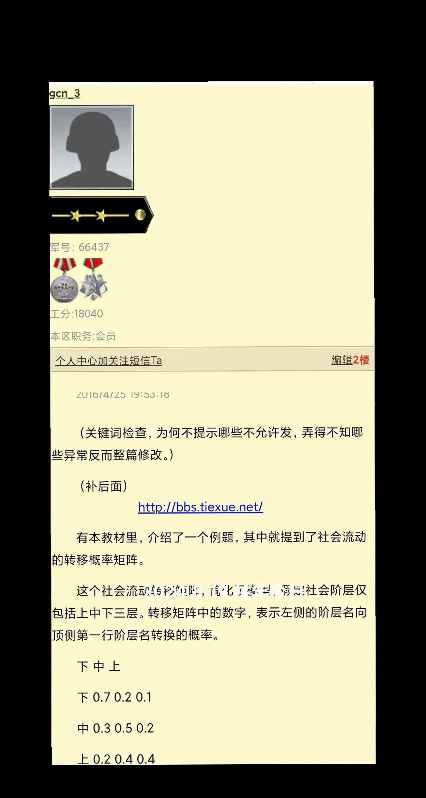
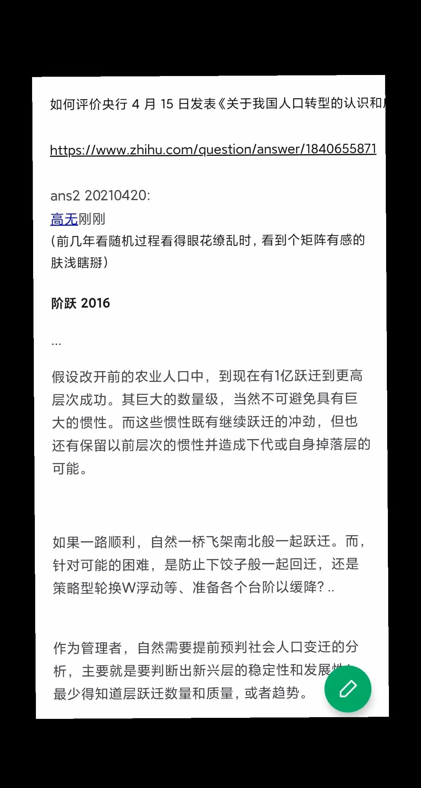

[TOC]  

# 补 “阶跃” 2025.08.19 + 破事
  
  

**//- 2025.08.19 09:05**   
现在是啥也不能做的，    
一做， 这些阴畜垃圾就发狂， 更加恶毒恶狠折磨！    
根本没法正常生存！ 只有杀光这些畜牲全家及其它们制造的臭虫毒虫寄生虫！    
  

凌晨刷视频， 抖音弹出个“往年今日”， 补充几句。后来睡觉， 这些狗日的贱种又发狂， 又在想偷啥剽窃啥？ 各种恶毒折磨！    
  
  

**//- 2025.08.19 凌晨**    
   
  

补，    
资本主义开山鼻祖圣典 《国富论》：    
个体私欲动力， 能在市场这无形之手的调控组织下促进社会整体利益。    
社会化大生产基石要求分工合作的平等公平环境竞争博弈！    
财富不完全是资本！ 资本是要投入再生产的那些！ 资本天然内在动力追求“变化发展”！    
...    
  

某些地域， 几千年的封建权本位熏陶， 内在根深蒂固思想抗拒社会化大生产平等分工合作公平竞争博弈！ 比如前苏联， 各种理由借口找其它主义找教材进行反人类文明的篡改扭曲！ 妄图维持皇毒权这类“自私到极致私天下”以天下为敌、 天下莫非王土王臣王奴、 牧天下掠劫以饲统治腐朽！ 自然， 更不会以规则约束内在必然腐朽！    
...    
  

《资本论》 揭露的剥削， 不仅仅是资本主义， 但在社会化大生产、 工业革命背景下，  便捷交通与讯息让残酷性更加充分暴露在世人面前！    
但， 资本主义是只会顽固不思进取吗？ 不说远的， 近如福特新中产阶级、 罗斯福新政等， 这些是开历史倒车还是在改良？！ 美国成为地球第一霸主， 难道是虚有其实？    
自由经济市场， 规则化经济活动社会活动， 不仅在促进一般产品完善质量， 也反哺促进社会管理的规范规则化！    
哪有脑控组织这样的下三滥畜牲还敢大张旗鼓在全社会肆掠！    
  

为了邪恶而邪恶为了恶毒而恶毒存在的脑控畜牲组织， 为啥就能肆意招募些地痞流氓下三滥各种作恶！ 为啥就能在全社会任意抓无辜民众做试验小白鼠！   
凭啥？   
比731更邪恶的权势！   
  

阴暗角落阴邪之地滋生出来的一堆粪坑阴渠臭虫蛆虫， 再有权势再炫耀也是腌臜垃圾！    
  
  

//- 2024.08.19    
   
  

   
  
  
