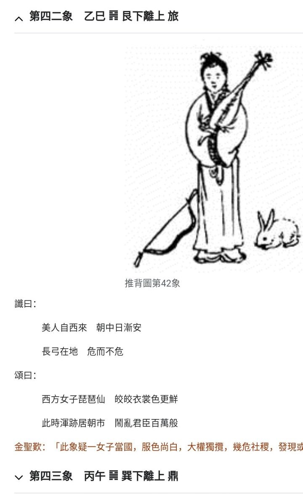

[TOC]  

# 推.42 - 接住老美的橄榄枝.md 

### 观感 

2024.10:   

文图不似只一码事， 似乎各说各的， 或许故意混淆。   
“美人”， 或指美国人， 尼克松访华。   
“长弓在地”， 两弹带来的底气， 虽不足（缺量缺质）， 总算“危而不危”   
“西方女子琵琶仙”，  “女子”是“好”字么？   “琵琶”， 西方“诸王”？   

若以 “江某” 解读本图文， 似乎有 “谬夸其人”， 与大众认知不一。    
  
  

补1：   
a.   
仅指 “江某”， 此图也就是叙事而已，    
只是 “西方女子” 暗指啥？ 江某原身是 西方琵琶仙（西昆仑、 持琵琶如 封神榜轩辕坟三妖之一的琵琶精 闹乱朝野的女子？ 西方欧美族裔？） 转世？ 西化的？   
  

b.   
美人是指美国人， 尼克松访华。 意思中美是有理性的、 可谈的。   
   

若果只是说， 70年代时， 欧美更先行更文明， 那么的确更“好”。  因而此厢， 应接住递过来的橄榄枝， 迈上现代文明的契机或快车道。 （暗合对应下一图 []。 千年古国再焕百花齐放姹紫嫣红就需持续持之以恒推进改开， 不仅经济上的也得有 **“朝中的、君臣的”**、 文化的、 文明的）   
  

但， 若果， 是更深远的因果渊源， “唐跌、 明勃衰， 最终是西方接稳全球历史文明成果盛到（推背图）结尾”，  那么此时此刻， 又一契机， 依旧顽固于旧思维腐朽帝权自锢一私不能共和民主平等的此厢是否还能走上“历史长河公认” 文明、 站上文明一阶？   
当然， 若知未来宏图， 为啥不选择尝试走上更好途径？ 而个人哩， 别太以私挟众。   
  
  

    
  
  
  
