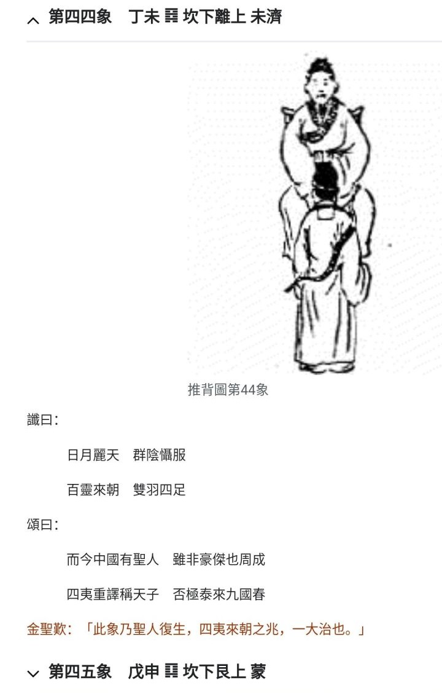

[TOC]  

# 推.44 - 做梦.md  

&emsp;&emsp; 似涉当下， 故曰梦。 当不当真， 自释。   

### 观感   

##### 原文 
推背图第四十四象 丁未  
   谶曰  
   日月丽天群阴慑服  
   百灵来朝双羽四足  
   颂曰  
   中国而今有圣人  
   虽非豪杰也周成  
   四夷重译称天子  
   否极泰来九国春  
   金圣叹：  
   此象乃圣人复生，四夷来朝之兆，一大治也。  

##### 补 
2024年11月01日   
2023年终于要离京了， 鬼知道咱“YY” 的这些是啥， 故全扔出来了。   
本来谁能接住啥， 也不知。   

但是， 狗日的垃圾小偷儿们， 之恶毒！   
当然还各种耍法， 逮着个 “周” 字， 于是开始设计“周”姓还是啥的人。 没点哈数， 更加恶毒！   
  

[推.43 - 君非君臣非臣，南巡扶一程](./推.43%20-%20君非君臣非臣，南巡扶一程.md)   
（2024年又一青龙年， 大家凑吉瑞没啥。 但某些人不仅恶毒， 还妄图装神弄鬼、 按推背此图制造鬼扯zhou/zou姓人物、比如周邹刍等姓！想用2024年窃伪本图大批生产“黑兔青龙”， 有的骗一群生育机器，有的弄出国几年改下出生日期后再回国..一堆奇葩，胆儿真肥。）    
  

而且是否“负弓者”， 那还要看“弓”是啥， 比如 推.42 兔弓？   
[推.42 - 接住老美的橄榄枝](./推.42%20-%20接住老美的橄榄枝.md)    
  

狗日的垃圾， 不管你们是坑蒙拐骗坑小妞们， 还是移花接木扶持小弟， 别将咱裹挟到你们的下三烂故事！   
我与你们， 只有与邪灵不死不休的！   
蝼蚁死磕邪灵， 总要试试！   
  
  

##### 三释 
(知乎_a Weibo_a  2023.01.12a)   
[cp]YY补推.44 “九国春”，   

若按谐音， 那或是保底的， “捕捉、 积极争取九个、 多个春， 九年、多年以上”。   

若按九国多国可获契机， 那么又有差别：   
下， 多国各获契机与己无关。   
中， 助上合之类中的几国能入九。 其它可入围的或无关    
上九国， 联合国五大、 七国集团等， 当前世事条件如此。 共协其大半以共得契机。   
..   

(不知哪位可如图应呈， 终顺利斩获契机。   
咱得断尾了， 垃圾畜牲们的恶毒， 更愈发阴损了)[/cp]  
END   
  
  

##### 二释 

https://m.weibo.cn/3429802302/4828029899509178  
[cp]http://t.cn/A6ooaGqg  

(丁未年 67年 27年)   

观两图个人强释：   

天局主子们、 诸子们， 自会知，   

事业未济， 群策群力。   

要 “国富” ， 先施蜜、 引众酿。   

   

a.   

推背图， 负弓自鉴(箭)者， 或也可解释为无箭也能建功(弓)。   

  当然， 若考虑推背后几图， 宜良策御兵， 未来方可善解。   

  所谓， 良将易得， 仲衡之相难为。 李斯遇秦皇良， 遇二世才亡。   

b.   

否极泰来   

闭塞否极之时， 需循序放开。  

若想善始善终， 宜有经验的旧有团队站好这班岗。   

(说句不好听的， 也有可能善结不了啊。 不过， 未济未尽时别这么窝里斗。 良食方产好奶)  

http://t.cn/A6ooaGqd  

《推背图·第四十四象》解未济卦  

《断易天机》解未济卦 [/cp]  
  
  

##### 一释 
Weibo_a temp_tmp_41830 10/24/2022   

推.44， 个人强释：  

天(局座)子们， 自会知，  
事业未济， 群策群力。  
要 “国富” ， 先施蜜、 引众酿。  

负弓自鉴(箭)者， 或也可解释为无箭也能建功(弓)。  
当然， 若考虑推后几图， 宜良策御兵， 未来方可善解。  
所谓， 良将易得， 仲衡之相难为。  

闭塞否极之时， 需循序放开。  
https://www.zhihu.com/pin/1567811426386657280  

  
  

   
  
  
  
