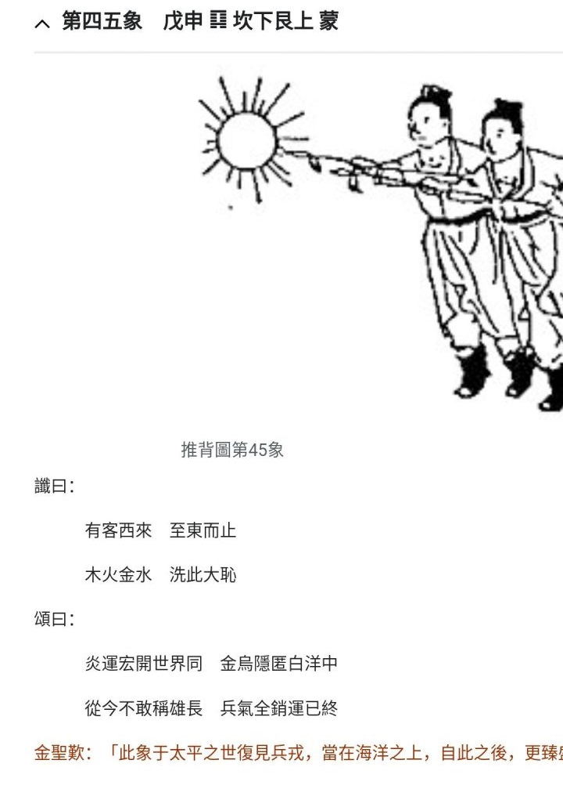

[TOC]  

[相关笔记 - 推.45~47 - 杂.md](./推.45~47%20-%20杂.md)   

# （此图乱序，已销毁） 推.45 - 如日中天，刺.md  
&emsp; 传说， 曾有威武霸气狂妄的帝王， 搅乱了些后世图序。   
&emsp; 此图， 可用1945美国原子弹解释， 故不应在此   
 
&emsp; 而且此图若非1945，   
~~推.45 销毁~~   
&emsp; “金乌隐匿白洋中”， 战场似过于炸爆， 后果影响剧烈（也就只有1945之后50年的国际形势演变才可有吻合， 斩日本之崛起势头。 而今及之后， 日本已快鸡肋化， 削之无甚好处， 反恐） （YY: 美国背后的推手？先知？ 或许真厉害， 提前布局谋夺到了这招）   
 
&emsp; 故， 相关时间线和事件， 在此的推45返归1945、 此销毁更好些   
  
  

##### 额外的可能引子 
a.    
西方的玄幻故事里， 上帝天使是无性别或共性的，    
西方的邪灵AI培养时，  或尝试无性别的AI。 按理本或应使用性别通用性， 但似乎其剧本却在诱导地泛滥LGBT之类（以产生各种各样性别杂音？）。    
  

b.    
动漫EVA， 人机需要“同步率”   
电影“环太平洋”， 则是机甲操控人员需要些“同步”   
...    
  
  
  

## 推背图45 
   
  

1.    
有说本图， 或是错序， 原本或许是图39前后， 指二战1945时2颗核弹    
..    
那么， 没此图， 44图后应直接就再下一图？    
  

1.    
如果不是指二战， 本图图序就该是这。    
图解词， 或一场战争。 对比后面些图， 此战或许还比较“正统”不那么玄乎， 或许算是正统战的“最终之战”吧。 （也或，最后的辉煌挣扎吧）   
  

这里可先考虑下， 图中“日”“二人”等该何解？    
  
  

a.    
二特殊人物， 引领对“日”之战？    
当然， YY下， 图中比较整齐划一的二人， 军训合格的战力？ 具有很高 “同步性” 的战斗人员？    
  

假设这需要 “同步性” 的是， 需要训练的， 怎么来？    
怎么破坏？    
  

b.    
“日” 表“正”or“上阶”    
二人， 则是“叛”or“逆”or“刺”..    
（此不匹配解图辞句）   
  
  
  
  
  

## 推.39 日落南山
因推.45顺序存疑， 此图哩？    
  
若按1945前后YY此图，    
仅从图解，    
日在山脚， 落日余晖？ 还是图辞“旭初升”    
  

落日解，    
假设图38指一战， 图45指二战， 本图二战后世界大势    
曾经“日不落”的英国也山脚， “南山雀”美国白头翁大雕和“北山罗刹国”苏联双头鹰占据山巅。    
因此， “旭”可指罗雀之一的美国五十年后成为全球霸主。    
  

“南山有雀北山罗”， 以罗雀指二战后 南北+两霸 对立， 古人似有不服气呀（或者说， 揭示了此厢无厘头的狂妄傲娇自大）。 可是..    
“金鸡”， 地图从秋棠叶衰减成鸡， 的确其实更没啥可夸耀..   
2025了， 金鸡叫了吧。 “日已过”， 相对金鸡中， 此日或就指日本了。    
  

   

  
  
  
  
  
