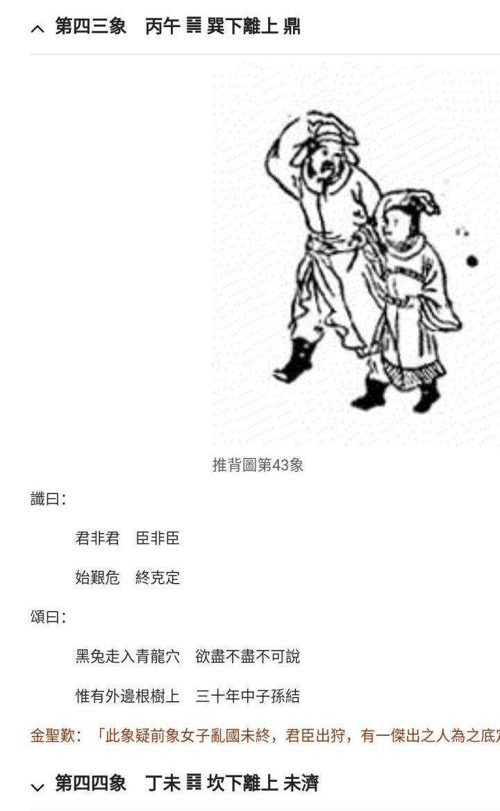

[TOC]  

# 推.45~47 - 杂.md  

### 观感   

2024.11:     
蓬勃
瞎掰 “白头翁” 关联性 a one     202x.12.0x.mxt  

补2 2024.12.05 13:00 
大航海、 地理大发现， 为啥是西方劫掠获得全球各旧文明传承？ 

假想a. 看了推图，米国才选白头徽，以图获得某些时候的运势加持？ 

假想b. 假设美洲就是天选之地，有近似陆桥的亚洲，为啥不能建立贸易链通道？欧洲反而逆袭获得天选？ 

天道奖励， 作局推动几下， 米国不经意就选择了白头徽.. 

即使占据天选之地的印第安人， 以野蛮祭祀， 扭曲启示， 不追求文明， 也终会被抛弃！ 
假想c， 三星堆是上古祭祀之地， 商之前旧祀以人牲， 周等反叛改革， 残余众迁徙， 周等获得文明嘉奖， 美洲则一直野蛮祭祀不得进取。 秦始皇等再择文明直至唐巅峰， 之后却不思进取， 逐渐被抛弃.. 

推图.24， 太阳， 日出还是日落？ 
日落，宋末余晖？ 
一线之木， 寻日出之地？ 扶桑在现日本还是北美？ 
其实， 后人都可想象， 没必要拘于一隅。 

反正、 总之： 
宋实亡于偏安思维， 统治阶级群体的自私狭隘愈发自陷并逐渐愚蠢化！ 

崖山之后无中国，明亡之后无华夏。
唐巅峰之后， 人种堕落文明溃。 

sb化。 

朝贡体系， 自娱自乐的sb们， 也就只能有效占领剥削一小块地盘。 自安史之乱后， 被打折脊梁， 再无汉唐之自生纠错革新蓬勃进取之心。  

皇独权思维熏陶下， 整个社会趋向于自私、 无信、 愚蠢， 恶毒、 邪恶。 
权势的自私自利， 包括为之构建的自陷体系， 必然的走向愚蠢sb邪恶化。 

补1  2024.12.04 17:50 
命定之事，就是运势加持， 白头翁就具有运势、一定能成！ 更别说国势， 失败一个可能的白头翁， 自然还有另外一个白头翁， 无论阿猫阿狗， 只要成事就是白头翁！ 
消灭一个轻易而举的白头翁， 自然还有更好的白头翁！ 直到事成！  
狗日的畜牲杂种垃圾， 必须死！ 

抖a 17:39 
一群狗屁不懂、 好逸恶劳， 啥都以为偷得着的下三滥！
...
假设真存在命定之， 都知道说出来就不灵了、 失效了
当然也可能是， 显而易见的选项不准了！
搞不搞形，意不意外
不用偷， 白给你们了！
狗x的

抖a 17:19 
默默耕耘潜伏了多少年的带箭白头翁么？内外戚居然..

  
  

<!--    
  
  
   -->
