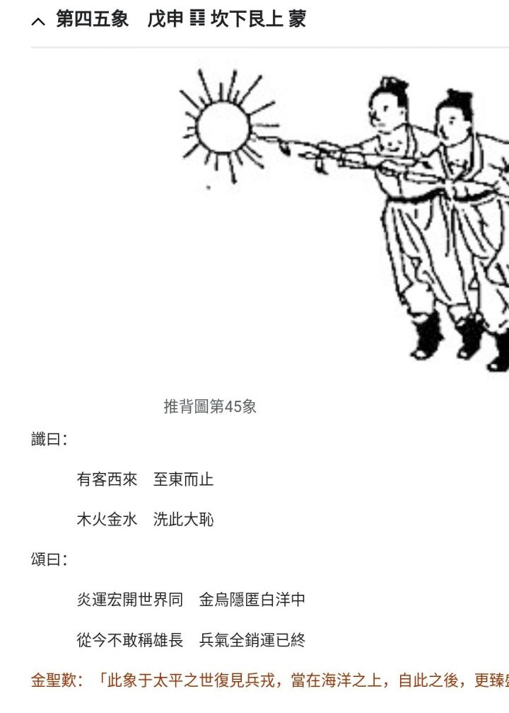
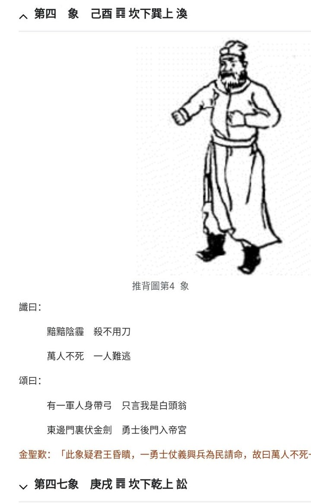
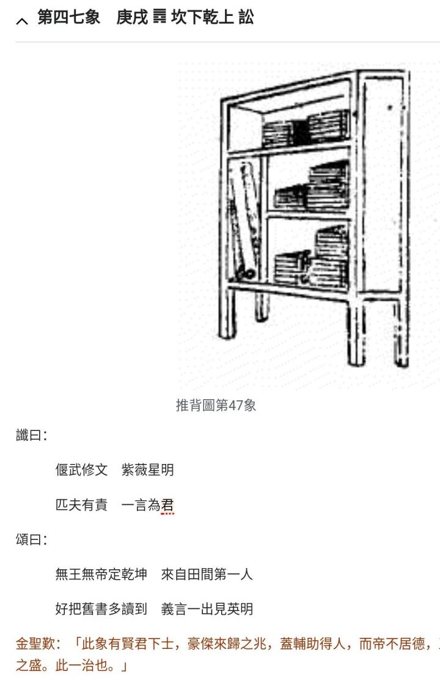

[TOC] 

# 推.45~47 - 杂.md  

本文， 非本地本时代， 瞎掰着玩的..   

[相关笔记 - 推.45 - 如日中天，刺](./推.45%20-%20（此图乱序，已销毁）%20如日中天，刺.md)   

### 观感   

2024.11:   
蓬勃
#### 瞎掰 “白头翁” 关联性 a one     202x.12.0x.mxt  
  
  

##### 补2 2024.12.05 13:00 
大航海、 地理大发现， 为啥是西方劫掠获得全球各旧文明传承？   
  
假想a. 看了推图，米国才选白头徽，以图获得某些时候的运势加持？   
  
假想b. 假设美洲就是天选之地，有近似陆桥的亚洲，为啥不能建立贸易链通道？欧洲反而逆袭获得天选？   
  
天道奖励， 作局推动几下， 米国不经意就选择了白头徽..   
  
即使占据天选之地的印第安人， 以野蛮祭祀， 扭曲启示， 不追求文明， 也终会被抛弃！   
假想c， 三星堆是上古祭祀之地， 商之前旧祀以人牲， 周等反叛改革， 残余众迁徙， 周等获得文明嘉奖， 美洲则一直野蛮祭祀不得进取。 秦始皇等再择文明直至唐巅峰， 之后却不思进取， 逐渐被抛弃..   
  
  
推图.24， 太阳， 日出还是日落？   
日落，宋末余晖？   
一线之木， 寻日出之地？ 扶桑在现日本还是北美？   
其实， 后人都可想象， 没必要拘于一隅。   
  
  
反正、 总之：   
宋实亡于偏安思维， 统治阶级群体的自私狭隘愈发自陷并逐渐愚蠢化！   
  
崖山之后无中国，明亡之后无华夏。   
唐巅峰之后， 人种堕落文明溃。   
  
sb化。   
  
朝贡体系， 自娱自乐的sb们， 也就只能有效占领剥削一小块地盘。 自安史之乱后， 被打折脊梁， 再无汉唐之自生纠错革新蓬勃进取之心。    
  
皇独权思维熏陶下， 整个社会趋向于自私、 无信、 愚蠢， 恶毒、 邪恶。   
权势的自私自利， 包括为之构建的自陷体系， 必然的走向愚蠢sb邪恶化。   
  
  
  
  
  

##### 补1  2024.12.04 17:50 
命定之事，就是运势加持， 白头翁就具有运势、一定能成！ 更别说国势， 失败一个可能的白头翁， 自然还有另外一个白头翁， 无论阿猫阿狗， 只要成事就是白头翁！  
消灭一个轻易而举的白头翁， 自然还有更好的白头翁！ 直到事成！   
狗日的畜牲杂种垃圾， 必须死！  
  
  
  
  
  

##### 抖音_a 故事     2024.12.0x 17:39     ## 命定之说出来就不灵了失效了，or只是消除个简单容易的可能 
一群狗屁不懂、 好逸恶劳， 啥都以为偷得着的下三滥！ 
... 
假设真存在命定之， 都知道说出来就不灵了、 失效了 
当然也可能是， 显而易见的选项不准了！ 
搞不搞形，意不意外 
不用偷， 白给你们了！ 
狗x的 
  
  
  
  
  

##### 抖音_a 故事     2024.12.0x 17:19     ## 美国国徽+默默耕耘潜伏了多少年的带箭白头翁么？内外戚居然.. 
   
  
  
  
  
  

##### 推.45~47
推背图1-60象(下) - 知乎   
  
白头翁， 能入帝宫， 就已不是普通“军人”！ 非当值保卫的， 就是内外戚身份， 不仅东门而且后门都是任意可入。   
  
  

---    
45图， 或许是一场国战。    
看描述， 玩得酣畅淋漓热闹非凡。    
  
战后， 沸沸扬扬。 本来按实际真正战功， 论功行赏， 似也没啥。 然后大家收收心，趁热情和积极进取性赶快再扎实发展下整体。    
  
但是像其它图， 某些人其实也早就盯上了各图， 装神弄鬼！    
这里， 能趁机捞好处的是哪些人？ 当然更多就是各种2代N代！ 不敢上正面的、直接的前线战场， 反倒是各种争抢好处！    
  
战后暗藏的动荡，主要还是分赃不均， 没背景的得不到应有的功，有背景的又认为功不配其吹嘘和坑蒙拐骗偷所付出。    
反正都不满意， 都埋怨。   
...    
积累久了，然后就白头翁了。 （有军弓军器之人，并不仅指军队， 包括所有暴力机关的。 后门不仅仅指实体的， 也有各种设备的设计后门等）   
  
...    
所以后来就是47图文治武功。   
  
---    
既然将来某时会这样那样， 为啥不能提前促进“文化力量”？ 至少能让各暴力机关有自知之明， 认清自己的本职， 其掌握的暴力力量只是责属配备而非其自然而有， 与其它职业并无啥特殊！ 更也不该有超国民待遇！    
  
国器是国家的！ 某人掌握国器， 只是正好其职业发展时段遇到， 而非天然该其私有！    
  
  

   
   
   
  
  
  
