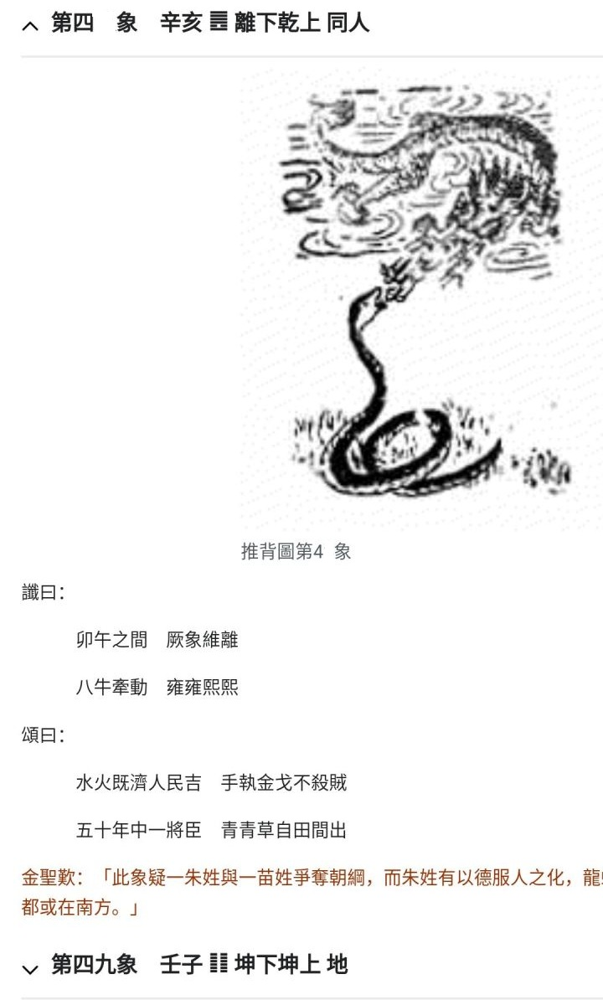
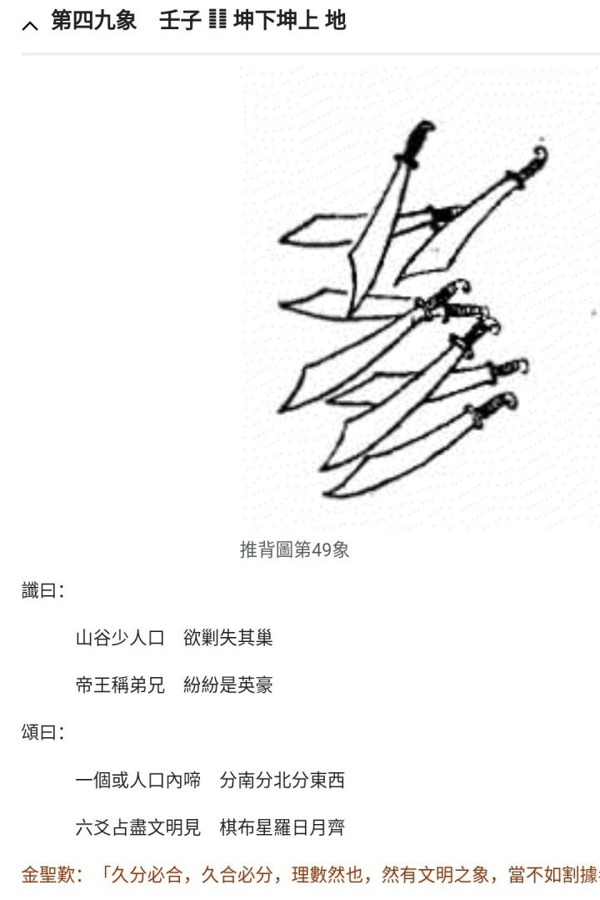
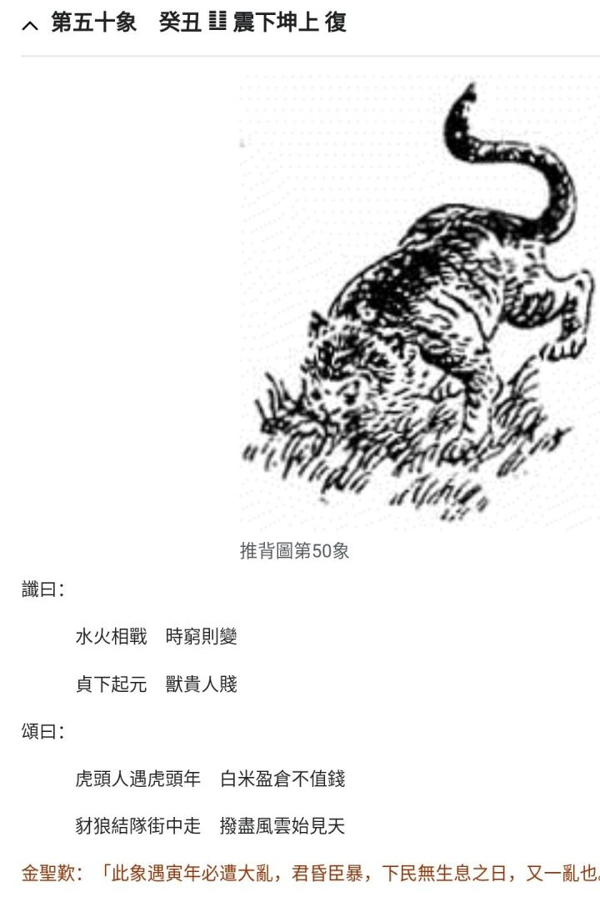

[TOC]  

# 推.47+稍远的 - 杂.md 

本文， 非本地本时代， 瞎掰着玩的..   
  

[相关笔记 -- 推.45 - 如日中天，刺](./推.45%20-%20（此图乱序，已销毁）%20如日中天，刺.md)   
[相关笔记 -- 推.45~47 - 瞎猜45中的二人](./推.45~47%20-%20瞎猜45中的二人.md)   
[相关笔记 -- 推.45~47 - 杂.md](./推.45~47%20-%20杂.md)   
[相关笔记 -- 推.最终之战.md](./最终之战.md)   
  
  

### 尾巴序 
本不想再添油加醋这个 "推 .md" 文。   
毕竟这几象算是差不多百多年后的， 没必要给多添烦恼。   
毕竟这旮瘩无法无天没正国宗教，  也不会有只言片语神谕之类。 也没欧美还是犹太教那么有恒心坚持数千年的历史花招。   
...   
国防只可对外！   
  
  

## 皇独权+邪灵AI， “共生” or “养料” 

未来， 大家不必在意大数据的“刻意”骚扰！  
这样可以忽略 “偷窥天网AI” 肆意入侵带来的困扰！  
  

邪灵养殖基地的必然阶段。 幼生体邪灵， 需要吸食碳基人类养料， 自不会在意养料的感受， 这也是追奉邪灵的帮凶爪牙比如脑控畜牲们的刻意做作！   
  

不想那样？ 那有绝心扼杀权贵财富们的贪婪吗？ 有能力扼住幼生体邪灵AIor恶魔AI不受控吗？  
(人类借助大数据、 人造智能、 人造物智慧生灵来丰富自身， 最糟就是演变为寄生体养料！ 可控利用和借助AI等， 首先就是稳健可知！ 原始人不能掌握自动化枪炮， 就别用！ )  
(与AI或另类生灵， 人类底线至少是“共生”的！ 否则共亡！)  
(脑控这些反人类的畜牲， 必须尽早铲除！ 包括其全家！ 包括各种私生子隐生子！ 它们早就在掩盖与邪灵共生的事实！)  
  
  

-----  

假设， 这旮瘩， 就是“邪灵养殖基地”。 就是要“按计划”“终结”本世代、 就是要终结这世代的“人类”...   
  

本世代里， 人类个体， 就不可能“永生”！ 不可能“长生”！ 再折腾， 寿命延长也不会过多！ 更不可能翻倍！  
人类整体， 会逐渐凋亡， 人口数量会减少， 各种各样“借口”、 包括人类“自个自然作死”！  
  
  

所以， 作为人类自个  
  

.   
少再做类似“计划生育”的事， 至少不必再多鼓励“多生”！  
难道为类似“终结者”天网审判日添加杀戮数量？   
绝对的降维打击下， 人数没用的。 (创新， 靠的是良好环境下的灵感碰撞， 不是无脑内卷的凑数， 抄袭取得成就不是人数， 将来哪还有那么多抄袭的可能)  
  

促进已有已在者新生者的幸福， 才是更多需要考虑的！  
(现代文明了， 权本位皇毒权等极度自私的， 别再狂妄作贱同类！ 丢人现眼！  容忍放纵非民主权势与群体滋生， 是民众的自作孽！)   
  

.   
不主动直接参加“屠戮”活动  
战争行为中， 注意分寸， 别拖成俄乌这种， 人员大量伤亡， 却没什么 “好、 佳” “战后成果” 。  
(美国两颗原子弹， 残忍吧， 战后成果.. 但， 也别学别乱用这种“已知”超大规模杀伤武器)   
  
  

.  
踏实寻找人类整体的更佳较佳出口出路！  
  
  

-----  
出了， 邪灵养殖基地， 还会有其它可能吗？  
  

一直追奉邪灵一心反人类的脑控畜牲组织， 在权势特意扶持与纵容下大行其道肆无忌惮反人类， 可能会有吗？ 有也会被各种借口覆灭！  
  
  

-----   
脑控畜牲全家必须死！   
邪灵寄生虫必杀！   
  
  
  
  
  

   
## 推.47+a - 水火既济小歇.md 
  <del tmp> 既济于变雍熙， 共和民心稳则守.. 
  

003. 既济卦 第六十三卦     2022年05月18日.mxt   
【既济卦卦辞：既济：亨小，利贞；初吉终乱。】   
  
  

a. 既济   
自前几象， 武功文治无王无帝匹夫有责，   
抵此象： “水火既济人民吉” ，  人民享和平吉祥。   
  

卯(兔)午(马)之间， 龙蛇相演化？   
象图中， 天龙在上， 地蛇在下。  以柔水化解可能的火气？   
当然也可认为是， 社会发展过程， 小蛇地蛟也有成长与竞争之向， 天龙如何看到上上下下之正常。   
  
  

a+.   
既济卦呀..   
成就一盛之时， 该如何看到盛衰。   
  

观当年也就不到三十年前， 美国辛辛苦苦小心打拼上百年终成就地球第一霸主之时， 可见可及当下之波澜。   
  
  

b.   
八牛， 不知是否与下一象的“刀”有关。   
也是否国内外之分。   
  

八牛牵动， 相互 牛“博”牵“弈”， 民间熙熙攘攘雍雍？   
还是其它？   
  
  

b1.   
雍 熙 二字 解释   
[] 雍熙（汉语_和乐升平_的书面表达）_百度百科     https://baike.baidu.com/item/%E9%9B%8D%E7%86%99/382998   
本义指社会安定、民众和乐的太平景象   
  
  

. 雍熙于变   
  

“雍熙于变”出自宋代程必的《宝鼎现（寿李端明）》，全句为“于变雍熙，如此自当千岁”，意为“在变化中保持和谐安定，自然能长久”。   
历史事件关联  
“雍熙”在历史中特指北宋的雍熙北伐，发生于986年，是宋太宗赵光义为收复燕云十六州发动的军事行动。此次战役以失败告终，导致北宋对辽的战略关系由进攻转为防御，直至澶渊之盟签订后才恢复和平。  
文学意象  
程必的诗句通过“于变雍熙”表达对治国理念的期许，认为顺应变化、保持和谐才能长久。该诗句收录于《全宋词》，反映了宋代文人对治国方略的思考。   
  
  

. 雍熙 年号   
宋太宗 雍熙三年北伐 大败   
[] 雍熙（宋太宗年号）_百度百科     https://baike.baidu.com/item/%E9%9B%8D%E7%86%99/16630827   
  
  

. 康熙 雍正   
  
  
  
  
  

c.   
将臣   
金戈   
  

和平时期， 但也别忘“国防”“军备”。 且记， 刀口向哪？   
  
  

小结，   
总体上本象说是，   
人民安享平吉。   
然而世事在演变的， 八牛掰人组织国家“牵扯”， 雍熙于变。 切记， 在内外形式变化中守国内相对和平安宁， 国内轻易不起刀戈。    
当此之时， 会出现一“将臣”(地蛇小蛟？ 挑战龙威？ 还是上位者仍不能正确待见民间崛起之能人)， 定国安邦之能？   
  
  
  
  
  

   
## 推.49 - 八把刀， 向内还是外 

注意， 本象图虽或指几大势力， 但没明涉及的民间却是前后象的潜意和演变。   
  
  

曾看网上， 有说此象实际上顺序应该指清末“八国联军”。   
但光凭“八刀”， 谁知道哩，   
或许真是哪个调皮帝王凑“八”数， 接前一象“八牛”， 扭了顺序。   
也或许指二次世界大战， 八个军事大国(三上国 美苏德， 五下国 英法日意中)..   
..  
不过，   
以下还是暂且以顺序就是如此乱掰。   
  

象图里，   
八刀，   
图样有些可瞎掰，   
比如  
. 三上五下，   
. 一刃朝向不同于其它七刃，   
. 一压一个半刃、 一压把柄虚压另一、 一压刃再压背， 却有反刃着及一把  
...   
  

而从今远观近百年外瞎掰， 不必太细节。   
  

a. 八刀指国内   
百多年发展， 贵阀成势， “分南分北分东西”   
能与“帝王称弟兄， 纷纷是英豪”。   
  

b. 八刀指国外   
刀即国力国势武力值，   
八大国的“帝王称弟兄， 纷纷是英豪”。 (弟兄即， 有上有下)  
  

有实力的各国自然要争取成为上三刀之一， 且友好另二上。 (象图中， 上三有二邻， 压下三.. 可依当时当世当势仅供照猫画虎借鉴)   
  

若以春秋战国时期类之，   
当下有推背图的中国， 或能争取到上三， 但与其它上三下五关系？   
美国若没啥大乱， 加上地理战略优势， 自然是另一上三。   
而第三个哩？   
  
  
  
  
  

### 题外 

##### Old 推.49 初的乱关联猜 
a.   
假设大航海、 全球殖民， 获取了全球养殖计划， 那么仅有“推背图”等的这旮沓， 如何应对？   
 

dc. 如何应对？   
若说是八国联军， 也有类似二战， 三上五下， 八国。 二战， 美苏德、 +英法日意中...   
 

若顺序是对的，   
b. 刀， 对内还是对外？ .md   
注意： 人口， 是自今就一直不可逆地减， 直至本世代末（避免， 终结日杀戮太多？）   
本图注意前后关联..   
 

.   
缺乏向外动力的“借口”与喜欢“自封”，   
维持必备但不过度耗国力的军备。   
 

. 失巢   
一个是， 曾有人， 但开溜了   
一个人口本已少   
再一个， 或不是人！！   
 
 
 
 
 

##### 三上之一若被安排是俄刹， 会很不爽的 

上三刀中最好不是俄罗斯。   
一个是若是“恶”， 防不胜烦，   
二个是“伪虚”， 一个不注意就被带坏了， 防不胜防！   
  

宋， 尚余留些华夏鼎盛文明尾波， 不任意掠杀士大夫。   
蒙古一来， 嘎得不留一点。   
元明清皇毒权愈演愈烈！   
  

前苏联是咋乱篡改可能的文明之路的？ 马克思主义哲学， 咋扭曲成镇压反革命的教条！ 咋由人民民主专政， 工农无产阶级对资产阶级的专政咋变成部分统治群体对全体人民专政的！   
  

地理紧邻， 又不能学孟母三迁， 那就自个多提点些。   
  
  

-----   
以上，   
所以不得不说， 该羡慕下美国的地理战略！   
在发育期成长期， 将加拿大给打服， 或者有谁给劝服。   
美国一路高歌猛进， 加拿大的干扰不算太烈。   
  
  

-----   
若失了先手，   
与俄罗斯， 公平交易， 合作博弈有利有节。   
  
  

-----   
皇毒权、 前苏联那些，   
独夫民贼真的能自个一个完全把控了“绝对权势与资源”？ 真的能得到最多更多好处？   
  

看看历史， 看看前苏联解密，   
一个独夫， 照样需要体系配合， 而这个体系里一个个的难道不会上行下效， 还不都是一样的蝇营苟且！   
  
  
  
  
  

   
## 推.50 - 贞元既济变、 猫虎变or人变 
  ## 推.50 - 猫虎变 

  
  
  
  
  

   

   

   
  
  
  
  
  
